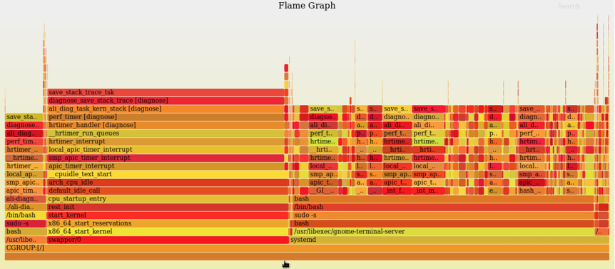

## perf
本功能每10ms对系统内的进程进行采样。采集进程名称/所在容器信息/内核态堆栈/用户态堆栈。
###  查看帮助信息
通过如下命令查看本功能的帮助信息：
```
diagnose-tools perf --help
```
结果如下：
```
    perf usage:
        --help perf help info
        --activate
            style dump style: 0 - common, 1 - process chains
            verbose VERBOSE
            tgid process group that monitored
            pid thread id that monitored
            comm comm that monitored
            cpu cpu-list that monitored
            idle set 1 if want monitor idle
            bvt set 1 if want monitor idle
            sys set 1 if want monitor syscall only
        --deactivate
        --report dump log with text.
        --test testcase for perf.
```
###  安装KO
参见《安装和卸载KO》一节
###  激活功能
激活本功能的命令是：
```
diagnose-tools perf --activate
```
在激活功能时，可用参数为：
* verbose 该参数设置输出级别，暂时未用。
* style如果为1，输出进程链。其他值不输出。
* tgid 要采样的进程PID
* pid 要采样的线程TID
* comm 要采样的进程名称
* cpu 要采样的CPU列表，如0-16,23这样的格式
* bvt 是否采集离线任务，默认不采集。
* idle 是否采集IDLE任务，默认不采集。
* sys 如果为1,表示只采集SYS，忽略用户态。用于专查SYS高。
例如，如下命令开始对gnome-shell进程进行采样：
```
diagnose-tools perf --activate="tgid=`pidof gnome-shell`"
```
如果成功，将输出：
```
功能设置成功，返回值：0
    STYLE：	0
    输出级别：	0
    进程ID：	11570
    线程ID：	0
    进程名称：	
    CPUS：	
    IDLE：	0
    BVT：	0
    SYS：	0

```
如果失败，将输出：
```
功能设置失败，返回值：-16
    STYLE：	0
    输出级别：	0
    进程ID：	11570
    线程ID：	0
    进程名称：	
    CPUS：	
    IDLE：	0
    BVT：	0
    SYS：	0
```
###  测试用例
运行如下命令运行测试用例，以查看本功能是否正常：
```
sh /usr/diagnose-tools/test.sh perf
```

###  查看设置参数
使用如下命令查看本功能的设置参数：
```
diagnose-tools perf --settings
```
结果如下：
```
功能设置：
    是否激活：	√
    进程ID：	0
    线程ID：	0
    进程名称：	
    CPUS：	0-1
    IDLE：	1
    BVT：	1
    SYS：	0
    STYLE：	0
    输出级别：	0
```

###  查看结果
执行如下命令查看本功能的输出结果：
```
diagnose-tools perf --report
```
在输出时，可以指定container参数，这样就可以在容器中使用perf工具了。如：
```
diagnose-tools perf --report="container=1"
```
在输出时，还可以指定reverse参数，一旦此参数为1，就会将输出结果翻转。也就是说，内核态调用链在火焰图的最底端 。用于配合sys参数查系统SYS高。如：
```
diagnose-tools perf --report="reverse=1"
```
输出结果中，包含perf命中的线程PID/名称，线程所在CGROUP组，内核态堆栈，用户态堆栈，进程链等信息。可以使用这些结果生成火焰图。
每次输出结果后，历史数据将被清空。
###  输出火焰图
diagnose-tools perf --report > perf.log
diagnose-tools flame --input=perf.log --output=perf.svg
该命令将生成的火焰图保存到perf.svg中。
使用浏览器打开perf.svg，如下所示：


 
