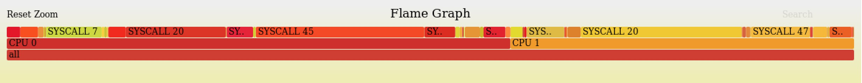

## sys-cost

###  查看帮助信息
通过如下命令查看本功能的帮助信息：
```
diagnose-tools sys-cost --help
```
结果如下：
```
    sys-cost usage:
        --help sys-cost help info
        --activate
          verbose VERBOSE
          tgid process group that monitored
          pid thread id that monitored
          comm comm that monitored
        --deactivate
        --settings dump settings
        --report dump log with text.
        --log
          sls=/tmp/1.log store in file
          syslog=1 store in syslog
```

### 安装KO
参见《安装和卸载KO》一节
### 激活功能
激活本功能的命令是：
```
diagnose-tools sys-cost --activate
```
在激活本功能时，可用参数为：
* verbose：该参数控制输出的详细程度，可以是任意整数。当前未用。
* tgid：要监控的进程ID。
* pid：要监控的线程ID。
* comm：要监控的进程名称。

例如，如下命令设置要监控的进程ID为1234：
```
diagnose-tools sys-cost --activate='tgid=1234'
```
如果成功，将在控制台输出如下：
```
功能设置成功，返回值：0
    进程ID：1234
    线程ID：0
    进程名称：
    输出级别：0

```
如果失败，将在控制台输出如下：
```
功能设置失败，返回值：-16
    进程ID：0
    线程ID：1234
    进程名称：
    输出级别：0

```
### 测试用例
执行如下命令触发测试用例：
```
sh /usr/diagnose-tools/test.sh sys-cost
```
### 查看设置参数
使用如下命令查看本功能的设置参数：
```
diagnose-tools sys-cost --settings
```
结果如下：
```
功能设置：
    是否激活：√
    进程ID：1234
    线程ID：0
    进程名称：
    输出级别：0
```
### 查看结果
系统会记录一段时间内系统调用的次数和执行时间。执行如下命令查看本功能的输出结果：
```
diagnose-tools sys-cost --report
```
输出结果示例如下：
```
CPU：0，时间：[1587955169:532299]
    SYSCALL：0, COUNT：3003, COST：96881178
    SYSCALL：1, COUNT：2022, COST：1234512
    SYSCALL：2, COUNT：1246, COST：2164344
    SYSCALL：3, COUNT：2477, COST：342223
    SYSCALL：4, COUNT：46, COST：76456
    SYSCALL：5, COUNT：53, COST：30890
    SYSCALL：6, COUNT：0, COST：0
    SYSCALL：7, COUNT：3400, COST：7641641
    SYSCALL：8, COUNT：3, COST：1783
    SYSCALL：9, COUNT：70, COST：237337
    SYSCALL：10, COUNT：32, COST：140419
    SYSCALL：11, COUNT：23, COST：118006

```
每次输出结果后，历史数据将被清空。
### 生成火焰图
可以用如下命令获取结果并生成火焰图：
提取结果中以"**"开头的行，然后用如下命令可以按调用次数输出火焰图：
```
diagnose-tools sys-cost --report | awk '{if (substr($1,1,2) == "**") {print substr($0, 3)}}' | /usr/diagnose-tools/flame-graph/flamegraph.pl > sys-cost.count.svg
```
提取结果中以"*#"开头的行，然后用如下命令可以按执行时间输出火焰图：
```
diagnose-tools sys-cost --report | awk '{if (substr($1,1,2) == "*#") {print substr($0, 3)}}' | /usr/diagnose-tools/flame-graph/flamegraph.pl > sys-cost.cost.svg
```

火焰图如下所示：



###  关闭功能
通过如下命令关闭本功能：
```
diagnose-tools sys-cost --deactivate
```
如果成功，控制台打印如下：
```
sys-cost is not activated
```
如果失败，控制台打印如下：
```
deactivate sys-cost fail, ret is -1
```
关闭功能后，本功能将不会对系统带来性能影响。
