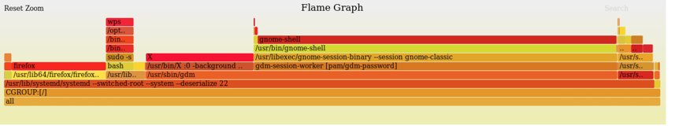

##  utilization
本功能监控系统资源利用率，找到CPU被哪些野进程干扰，以及进程对内存的使用情况。

###  查看帮助信息
通过如下命令查看本功能的帮助信息：
```
diagnose-tools utilization --help
```
结果如下：
```
utilization usage:
        --activate
            verbose VERBOSE
            style dump style: 0 - common, 1 - process chains
            cpu cpu-list that monitored
        --deactivate
        --settings print settings.
        --report dump log with text.
        --isolate CPU CGROUP set isolated cgroup name for cpu.
```
###  安装KO
参见《安装和卸载KO》一节
###  激活功能
激活本功能的命令是：
```
diagnose-tools utilization --activate
```
在激活本功能时，可用的参数有：
cpu 被监控的cpu列表；
verbose 该参数设置输出级别，暂时未用。
style如果为1，输出进程链。其他值不输出。
例如，如下命令将设置输出类型为1,即输出进程链：
```
diagnose-tools utilization --activate='style=1'
```
如果成功，将输出：
```
功能设置成功，返回值：0
    STYLE：	1
    输出级别：	0
    CPUS：		
```
如果失败，将输出：
```
功能设置失败，返回值：-16
    STYLE：	1
    输出级别：	0
    CPUS：	

```
###  设置参数
本功能可用参数为：
--isolate CPU CGROUP 设置某个CPU上独享CPU的CGROUP组，这些CGROUP组的进程不作为野进程对待。
如下命令设置CPU 1的独占CGROUP名称为tdc：
```
diagnose-tools utilization --isolate="1 tdc"
```
如果成功，将输出：
```
set isolate for utilization: 1, tdc, ret is 0
```
如果失败，将输出：
```
set isolate for utilization: 1, tdc, ret is -1
```
###  测试用例
运行如下命令启动本功能的测试用例：
```
sh /usr/diagnose-tools/test.sh utilization
```
###  查看设置参数
使用如下命令查看本功能的设置参数：
```
diagnose-tools utilization --settings
```
结果如下：
```
功能设置：
    是否激活：	×
    输出级别：	0
    STYLE：	0
    CPUS：	0-1
```
###  查看结果
执行如下命令查看本功能的输出结果：
```
diagnose-tools utilization --report
```
输出结果中包含野进程在CPU上运行的时间，分配的内存数量。
每次输出结果后，历史数据将被清空。

###  输出火焰图

可以生成三种火焰图：

1. CPU执行时间火焰图
2. 内存分配火焰图
3. 野进程干扰火焰图

以下三个命令分别用于生成这三个图：
1、CPU执行时间火焰图
```
diagnose-tools utilization --report | awk '{if (substr($1,1,2) == "**") {print substr($0, 3)}}' | /usr/diagnose-tools/flame-graph/flamegraph.pl > utilization.svg
```
2、内存分配火焰图
```
diagnose-tools utilization --report | awk '{if (substr($1,1,2) == "*#") {print substr($0, 3)}}' | /usr/diagnose-tools/flame-graph/flamegraph.pl > utilization.svg
```
3、野进程干扰火焰图
```
diagnose-tools utilization --report | awk '{if (substr($1,1,2) == "*^") {print substr($0, 3)}}' | /usr/diagnose-tools/flame-graph/flamegraph.pl > utilization.svg
```
该命令将生成的火焰图保存到utilization.svg中。该命令的含义是：
首先调用report命令输出内核中保存的结果，然后使用awk命令将”*”开头的行提取出来，最后的一个pl脚本将堆栈符号生成火焰图。
使用浏览器打开utilization.svg，如下所示：



###  关闭功能
通过如下命令关闭本功能：
```
diagnose-tools utilization --deactivate
```
如果成功，将输出：
```
utilization is not activated
```
如果失败，将输出：
```
deactivate utilization fail, ret is -1
```
关闭功能后，本功能将不会对系统带来性能影响。

